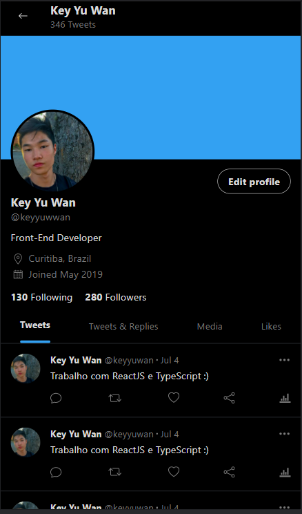
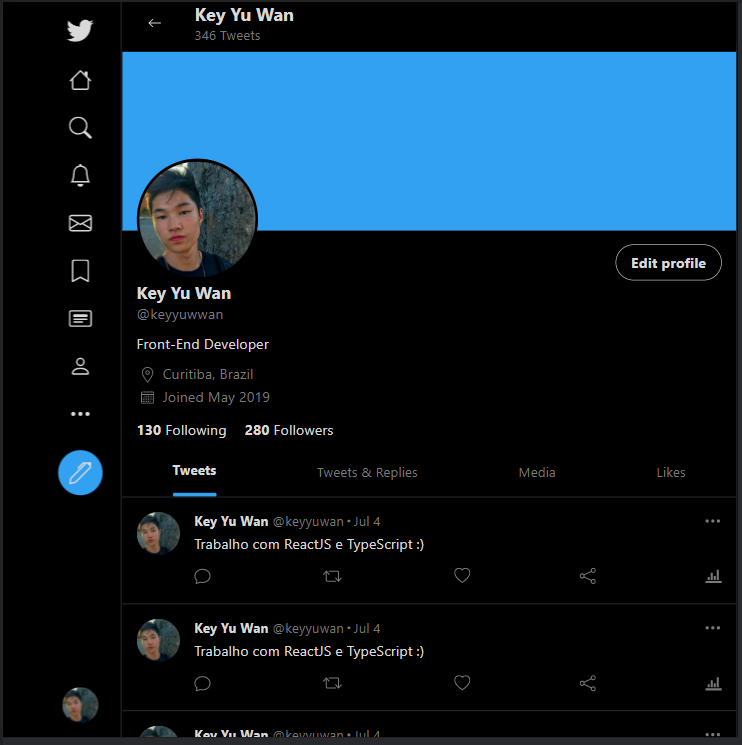
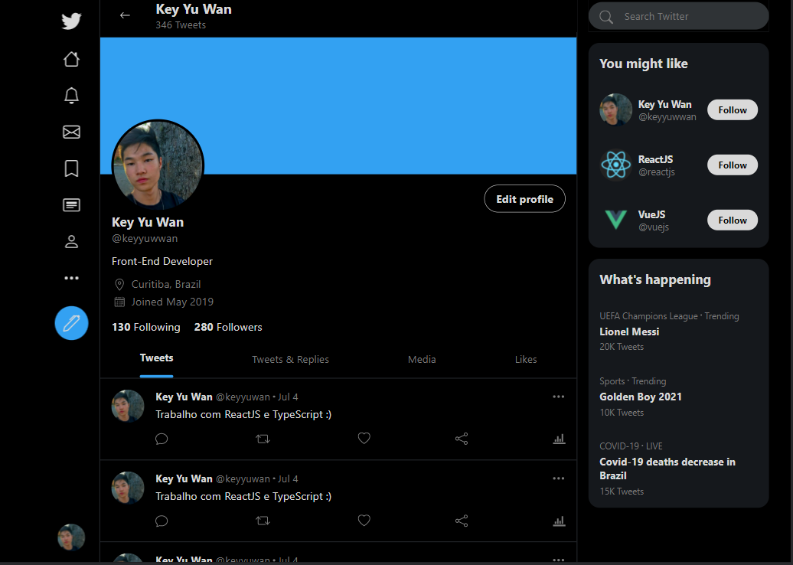
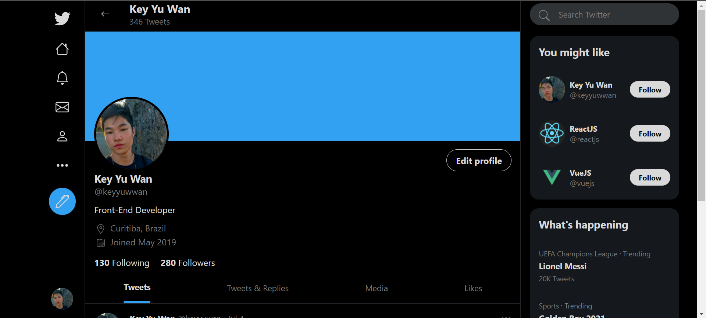

# ReactJS Twitter Clone (Responsive)

## 📸 Overview:

# 💻 Project:

In this project I tried to replicate the Twitter interface with ReactJS.  
I used the react-responsive lib to verify screen sizes, the react-sticky-box lib to make some containers sticky and the styled-icons lib to get the icons.  
I made it responsive and used the following breakpoints:  

- < 500px
- greater ou equal than 500px
- greater ou equal than 1000px
- greater ou equal than 1280px

# 🚀 Technologies:

### ✔️ ReactJS

### ✔️ Styled Components

### ✔️ Typescript
